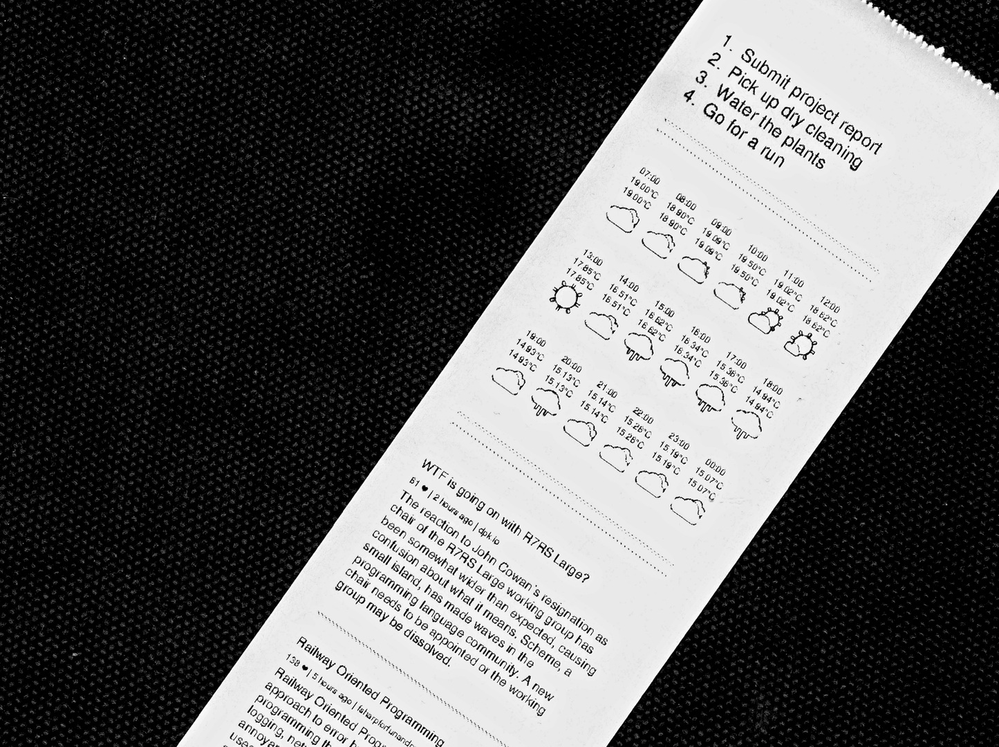
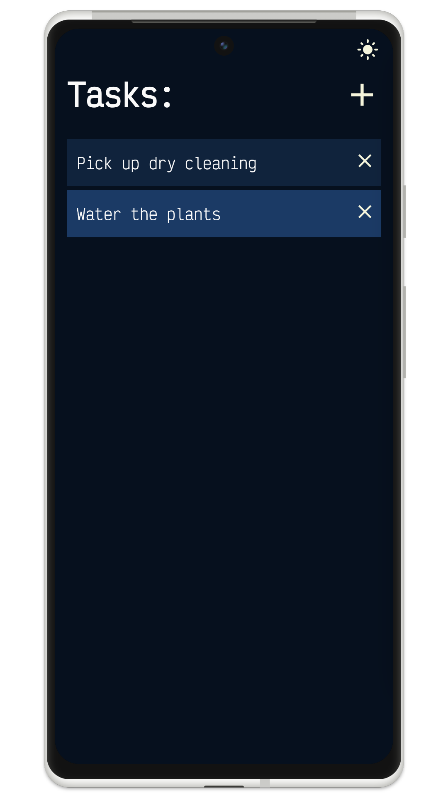
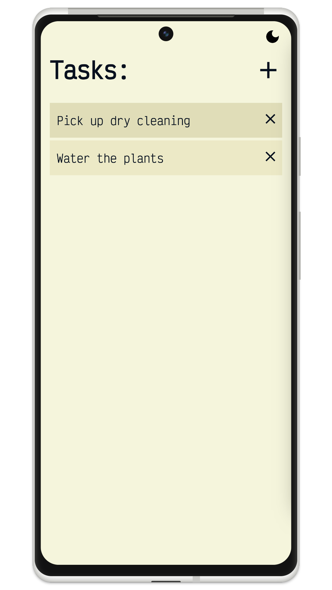
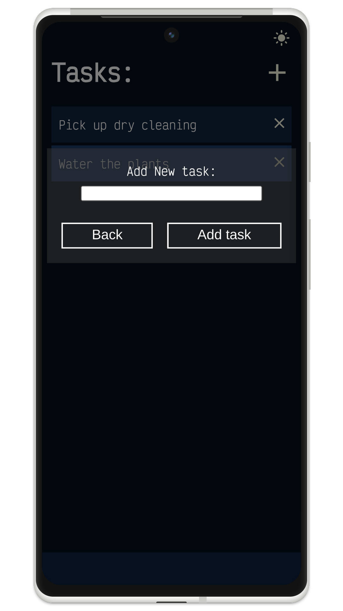
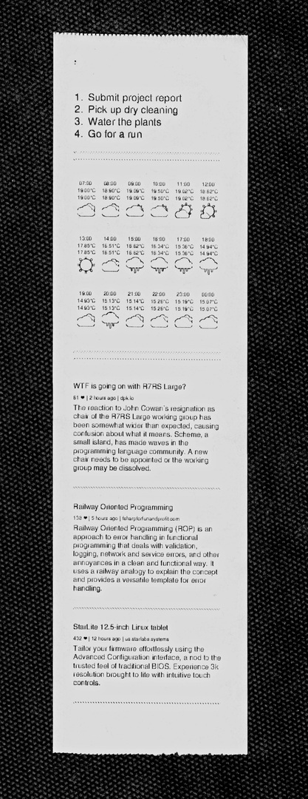

# Breaklist - A morning report generator for thermal printers


Breaklist is a toolkit that generates personalized morning reports, designed for thermal printers. The compact summary provides you with all your to-dos, reminders, weather forecast, and the hottest Hacker News highlights fitting snuggly on a dainty, receipt-like paper.

The morning report currently includes:

- A task list 
- Reminders
- Weather forecast
- Summary of latest top articles on Hacker News

There's also a friendly web app to help with managing tasks hassle-free.

<details>
<summary>Web App Visuals</summary>



</details>

<details>
<summary>Complete Report Example</summary>

</details>

## Features

- Tasks are stored in a `tasks.list` file in plain text format
- A web app provides an interface for managing tasks
- Reminders are stored in a `reminders.list` file using crontab format
- The weather forecast is retrieved from [Tomorrow.io](https://docs.tomorrow.io/reference/welcome)'s API (requires API key)
- Hacker News summaries are powered by [polyrabbit's hacker-news-digest](https://github.com/polyrabbit/hacker-news-digest)
- The morning report is generated as a PDF using [wkhtmltopdf](https://github.com/wkhtmltopdf/wkhtmltopdf)

## Getting started

### Prerequisites

- [wkhtmltopdf](https://github.com/wkhtmltopdf/wkhtmltopdf) needs to be installed. It can be downloaded from [here](https://wkhtmltopdf.org/downloads.html).
- A Tomorrow.io API key

### Installation
To use Breaklist, you can either download the latest release from the GitHub releases page or build it from source:

### [Downloding latest release](https://github.com/alibahmanyar/breaklist/releases/latest)

### Building from source
```sh
git clone git@github.com:alibahmanyar/breaklist.git
cd breaklist
make setup
make
```
The compiled binaries will be available in the `build` directory.

### Usage
Before running Breaklist, duplicate the `.env.example` file and rename it to `.env`, then populate the variables accordingly.

Once the variables are set, Breaklist can be operated using the following commands:

- The `reportGenerator` executable will generate the report as `breaklist.pdf` which can be printed using a thermal printer.

- The `webserver` executable will run the web application to manage the tasks. The web app will be available at `:3030`.

### Weather Forecast
The weather forecast includes temperature, "RealFeel," and an icon indicating the weather condition.

### tasks.list and reminders.list
The `tasks.list` file contains the list of current tasks in plain text format, with each task on a separate line.

The `reminders.list` file holds the reminders in a crontab-style format, with each reminder on a separate line.
Example:
```
#.---------- day of month (1 - 31)
#|  .------- month (1 - 12) OR jan,feb,mar,apr ...
#|  |  .---- day of week (0 - 6) (Sunday=0 or 7) OR sun,mon,tue,wed,thu,fri,sat
#|  |  |

* * *|Reminder 1 (Every day)
*/2 * *|Reminder 2 (Every other day)
* * 6,0|Reminder 2 (On Saturdays and Sundays)
```
